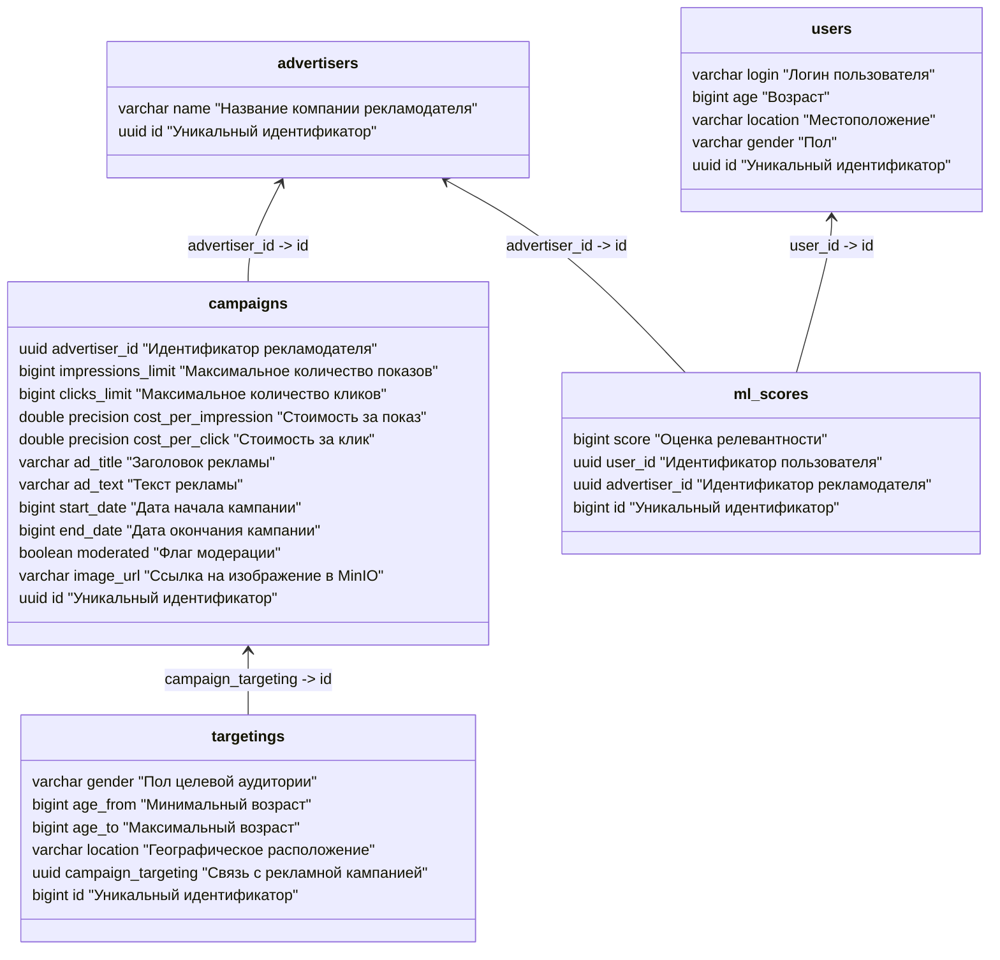
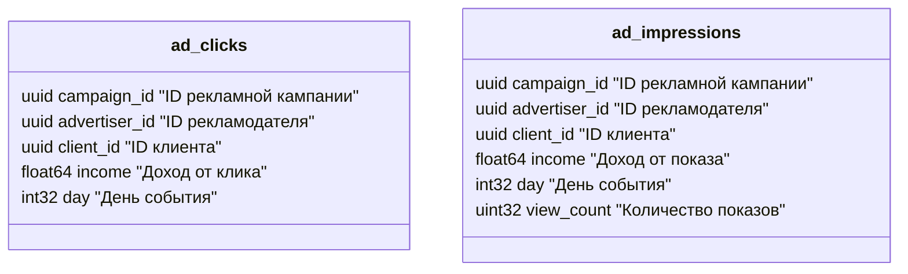
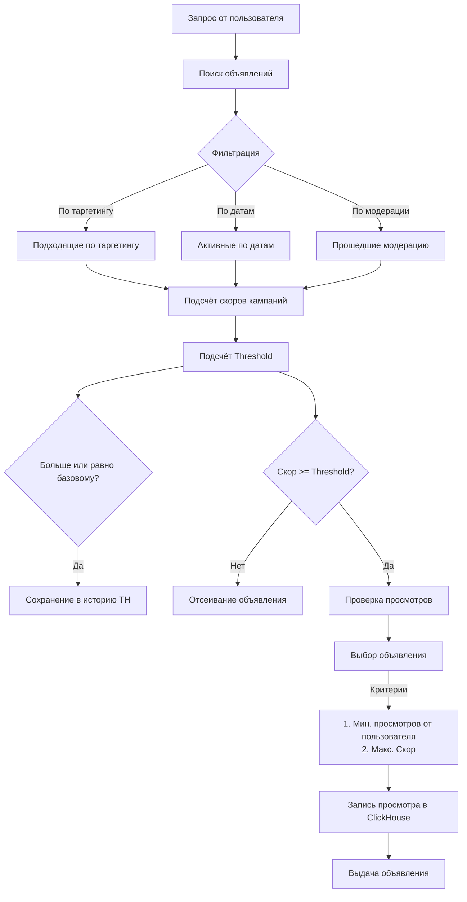

# 📱 Рекламная платформа

## 📑 Содержание

- [⚡️ Требования](#-требования)
- [🚀 Инструкция по запуску](#-инструкция-по-запуску)
- [📖 API Документация](#-api-документация)
- [📊 Схемы данных](#-схемы-данных)
   - [🐘 Postgres](#-postgres)
   - [🐳 ClickHouse](#-clickhouse)
- [🎮 Демонстрация работы](#-демонстрация-работы)
   - [API](#1-api-httplocalhost8080)
   - [Grafana](#2-grafana-httplocalhost3000)
   - [MinIO](#3-minio-httplocalhost9001)
- [🏗 Архитектура](#-архитектура)
- [⚙️ Принцип работы](#-принцип-работы)
   - [Подбор рекламы](#подбор-рекламы)
   - [Скоринг рекламы](#скоринг-рекламы)
   - [Threshold](#threshold)
  - [Загрузка изображения](#загрузка-изображения)
  - [Кэширование](#кэширование)
  - [Генерация текста](#генерация-текста-для-рекламных-кампаний)
- [Заметка](#note)

## ⚡️ Требования

- 🐳 Docker и Docker Compose
- 🔄 Git
- 🔓 Порты `8080, 3000, 5432, 6380, 8123, 9000, 9001, 9002` должны быть свободны

## 🚀 Инструкция по запуску

```bash
# Клонирование репозитория
git clone https://gitlab.prodcontest.ru/2025-final-projects-back/nlypage.git
```

```bash
cd nlypage/solution
```

```bash
docker compose up --build
```

### ⚙️ Настройка (опционально)

- В файле `.env` настраивается окружение разворачиваемое в docker compose
- В файле `/advertising/config.yaml` настраивается конфигурация Advertising-сервиса

## 📚 API Документация

Полная спецификация API доступна в формате OpenAPI: [openapi.yaml](./openapi.yaml)

### 🔗 Основные эндпоинты

1. **👥 Управление клиентами**

   ```http
   GET    /clients/{clientId}      # Получение клиента по ID
   POST   /clients/bulk            # Массовое создание/обновление клиентов
   ```

2. **💼 Управление рекламодателями**

   ```http
   GET    /advertisers/{advertiserId}                    # Получение рекламодателя
   POST   /advertisers/bulk                             # Массовое создание/обновление
   POST   /ml-scores                                    # Добавление ML скора
   ```

3. **📢 Рекламные кампании**

   ```http
   POST   /advertisers/{advertiserId}/campaigns         # Создание кампании
   GET    /advertisers/{advertiserId}/campaigns         # Список кампаний
   GET    /advertisers/{advertiserId}/campaigns/{id}    # Детали кампании
   ```

4. **📊 Показ рекламы и статистика**

   ```http
   GET    /ads                                             # Получение рекламы
   POST   /ads/{adId}/click                                # Фиксация клика
   GET    /stats/advertisers/{id}/campaigns/daily          # Дневная статистика
   ```

### 💡 Примеры запросов

1. **Создание клиента**

   `POST /clients/bulk`

   ```json
   [
   	{
   		"client_id": "uuid",
   		"login": "user123",
   		"age": 25,
   		"location": "Moscow",
   		"gender": "MALE"
   	}
   ]
   ```

2. **Создание рекламной кампании**

   `POST /advertisers/{advertiserId}/campaigns`

   ```json
   {
   	"impressions_limit": 10000,
   	"clicks_limit": 1000,
   	"cost_per_impression": 0.1,
   	"cost_per_click": 1.0,
   	"ad_title": "Летняя распродажа",
   	"ad_text": "Скидки до 70% на летнюю коллекцию",
   	"start_date": 1,
   	"end_date": 30,
   	"targeting": {
   		"gender": "FEMALE",
   		"age_from": 18,
   		"age_to": 35,
   		"location": "Moscow"
   	}
   }
   ```

3. **Добавление ML скора**

   `POST /ml-scores`

   ```json
   {
   	"client_id": "uuid-client",
   	"advertiser_id": "uuid-advertiser",
   	"score": 850
   }
   ```

## 📊 Схемы данных

### 🐘 Postgres



### 📈 ClickHouse



## 🎮 Демонстрация работы

### 1. API (<http://localhost:8080>)

#### Основные операции

1. **Рекламные кампании**

   - Создание и управление кампаниями
   - Настройка таргетинга

2. **Показ рекламы**

   - Умный подбор объявлений
   - Учет таргетинга
   - Отслеживание статистики

3. **Модерация**

   - Ручная модерация (опционально)

4. **Аналитика**
   - Статистика по кампаниям
   - Статистика по рекламодателям

Более подробная информация доступна в [API документации](#-api-документация)

### 2. Grafana (<http://localhost:3000>)

#### Доступ

- **Логин**: `admin`
- **Пароль**: `password`

#### Графики

1. **Подневное количество кликов**

    - XY chart
    - Количество кликов в день

2. **Подневное количество показов**

    - XY chart
    - Количество показов в день

3. **Прибыль платформы**

    - Bar chart
    - Подневная суммарная пибыль
    - Количество показов в день
    - Количество кликов в день


### 3. MinIO (<http://localhost:9001>)

#### Доступ

- **Логин**: `root`
- **Пароль**: `password`

#### Возможности

- Хранение рекламных материалов
- Управление медиа-контентом
- Мониторинг использования


## 🏗 Архитектура

| Компонент              | Описание                  | Обоснование выбора                                                                                                                                                                |
|------------------------|---------------------------|-----------------------------------------------------------------------------------------------------------------------------------------------------------------------------------|
| **Advertising-сервис** | Основной сервис на Go     | Высокая производительность и эффективная обработка конкурентных запросов, встроенная поддержка горутин для параллельной обработки, низкое потребление памяти                      |
| **PostgreSQL**         | Основное хранилище        | ACID-совместимость, надежность, расширяемость, распространённость, развитая система индексов, возможность горизонтального масштабирования                                         |
| **ClickHouse**         | Аналитическое хранилище   | Высокая скорость обработки аналитических запросов, колоночное хранение для эффективной агрегации данных, компрессия данных, поддержка распределенной обработки                    |
| **Redis**              | Кэширование запросов в бд | Быстрый доступ к часто запрашиваемым данным, поддержка различных структур данных, встроенная репликация и отказоустойчивость, атомарные операции                                  |
| **MinIO**              | Хранение медиа            | S3-совместимое хранилище, высокая масштабируемость, поддержка версионирования объектов, возможность распределенного развертывания, интеграция с CDN, удобная веб панель           |
| **Grafana**            | Визуализация              | Гибкие возможности для создания дашбордов, богатый набор визуализаций, интеграция с различными источниками данных (в т.ч ClickHouse), система алертов, поддержка ролевого доступа |

## ⚙️ Принцип работы

### Подбор рекламы



### Скоринг рекламы

Скор рекламы рассчитывается как взвешенная сумма трех компонентов:

1. **Релевантность (Relevance Score)**

   - ML-скор через сигмоид: `1 / (1 + e^(-mlScore/1000))`
   - Вес: `RelevanceWeight`

2. **Прибыль (Profit Score)**

   - Формула: `CPI × Показы + CPC × Клики × (1 + Релевантность)`
   - Нормализация: `1 / (1 + e^(-revenue/10000))`
   - Вес: `PlatformProfitWeight`

3. **Эффективность (Performance Score)**
   - Оценка отклонения от целей
   - Плавное снижение до 105% цели
   - Резкое падение при перевыполнении
   - Вес: `PerformanceWeight`

### Threshold

Алгоритм вычисления порога:

1. **Проверка истории**

   - Пустая история → базовый порог (0.7)
   - Иначе → динамический расчет

2. **Обработка данных**
   - Сбор уникальных скоров
   - Сортировка по возрастанию
   - Вычисление 80-го перцентиля

**Особенности**:

- Потокобезопасность через RLock
- Защита от дублей через map
- Логирование для отладки
- Ограничение истории

### Загрузка изображения

При загрузке установке изображения в кампанию производится проверка, является ли файл изображением.
Затем оно добавляется в MinIO и возвращается ссылка для доступа к изображению. MinIO настроен на публичное чтение.

### Кэширование

Для кэширования запросов в базу данных используется redis

### Генерация текста для рекламных кампаний

Используется модель **Gigachat-lite**

`POST /ai/advertisers/:advertiserId/generate/ad-text`

```json
{
  "ad_title": "Amazing Offer",
  "additional_info": "Добавь в текст МНОГО эмодзи"
}
```

Генерирует текст для рекламного объявления на основании заголовка и дополнительной информации (необязательно).

Язык текста объявления зависит от языка текста заголовка. Перед отправкой промпта получается язык заголовка и явно
указывается в промпте.

### ClickHouse

ClickHouse используется для хранения истории просмотров и кликов объявлений.
Просмотры и клики уникальные, но на просмотрах может инкрементиться view_count, который не участвует в статистике, но
используется в подборе.

## Note

```text
Привет! Небольшая заметочка от автора

Чтож, реализация с джобой хоть и была очень классной и нравилась мне, но мне пришлось от нее отказаться,
Все что от нее осталось - хранится в ad_scoring сервисе и в redis/ads пакете.
Можешь изучить если интересно)

К сожалению реализация не прошла в условиях тестовой системы и мне пришлось прийти к более простому решению,
которое я не успел довести до действительно хороших показателей из-за того что потратил много времени на прошлую реализацию
(А еще на то чтобы фиксить ошибку которой небыло :D)

Я вложил душу, время, силы, бессонную ночь и 2 кружки кофе в этот проект, надеюсь тебе понравится)
В проекте есть задел под телеграмм бота, но дальше задела дело не ушло)
```
